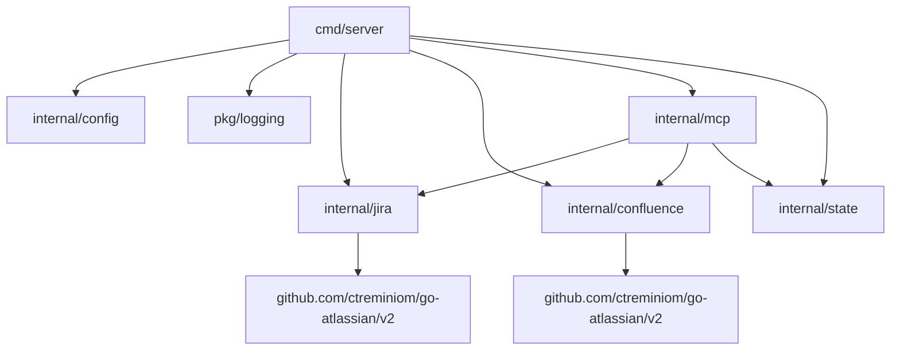

# Atlassian MCP Server

The Atlassian MCP server is a Go implementation of the Model Context Protocol. It exposes Jira and Confluence tooling over stdio using [mark3labs/mcp-go](https://github.com/mark3labs/mcp-go), enabling AI copilots and other MCP-aware clients to automate Atlassian workflows.

## Capabilities

- Idiomatic Jira and Confluence clients powered by the go-atlassian v2 SDK with shared authentication, caching, and structured error reporting.
- Ready-to-use MCP tools for common Jira and Confluence tasks (projects, issues, pages, search, transitions, attachments, and comments).
- Configuration by file or environment variables with `.env` support for local development.
- Make-based developer workflow for dependency tidying, linting, testing, and building a standalone stdio binary.

## Package Relationships



### Jira tools

| Tool ID                 | Description                                                   |
| ----------------------- | ------------------------------------------------------------- |
| `jira.list_projects`    | Return the accessible Jira projects (cached for the session). |
| `jira.search_issues`    | Run a JQL query and return issue summaries.                   |
| `jira.create_issue`     | Create a new issue in the specified project.                  |
| `jira.update_issue`     | Update issue fields with partial payloads.                    |
| `jira.add_comment`      | Append a comment using Atlassian document format.             |
| `jira.list_transitions` | Retrieve available workflow transitions for an issue.         |
| `jira.transition_issue` | Apply a workflow transition, optionally updating fields.      |
| `jira.add_attachment`   | Upload binary attachments to an issue.                        |

### Confluence tools

| Tool ID                   | Description                                            |
| ------------------------- | ------------------------------------------------------ |
| `confluence.list_spaces`  | List spaces available to the authenticated account.    |
| `confluence.search_pages` | Execute CQL searches and return page summaries.        |
| `confluence.create_page`  | Create pages with optional parent relationships.       |
| `confluence.update_page`  | Update existing pages with optimistic version control. |

## Prerequisites

- Go 1.25+ (matching the module directive in `go.mod`). Install via `gotip` or a Go distribution that provides 1.25 if you are building before the official release.
- Atlassian Jira and/or Confluence site with an API token or OAuth access token (per service).

## Quick Start

1. Clone the repository and install dependencies:

   ```bash
   git clone https://github.com/ylchen07/atlassian-mcp.git
   cd atlassian-mcp
   make deps
   ```

2. Copy the sample configuration and fill in your tenant details:

   ```bash
   cp config.example.yaml config.yaml
   ```

   Alternatively, copy `.env.example` to `.env` and export credentials there. Environment variables always override file-based values.

3. Build the stdio binary (emits `bin/atlassian-mcp`):

   ```bash
   make build
   ```

4. Run the server:

   ```bash
   # Uses config.yaml in the repo root by default
   make run

   # or explicitly point to a config file/directory
   go run ./cmd/server --config /path/to/config.yaml
   ```

Connect the resulting stdio process to any MCP-compatible client (e.g. mark3labs tools, Automations, IDE agents).

## Configuration

The server supports flexible configuration through multiple sources with automatic precedence:

### Configuration Methods

**Method 1: YAML Configuration File**

```bash
cp config.example.yaml config.yaml
# Edit config.yaml with your credentials
```

**Method 2: Environment Variables (Recommended for secrets)**

```bash
export ATLASSIAN_JIRA_SITE=https://your-domain.atlassian.net
export ATLASSIAN_JIRA_EMAIL=user@example.com
export ATLASSIAN_JIRA_API_TOKEN=your_token_here
```

**Method 3: Hybrid Approach**

- Store non-sensitive values (URLs) in `config.yaml`
- Use environment variables for sensitive data (tokens)
- Environment variables **always override** file values

### Configuration Precedence

1. **Environment variables** (highest priority)
2. **Config file** specified via `--config` flag
3. **Local config.yaml** in current directory
4. **User config** at `~/.config/atlassian-mcp/config.yaml`
5. **Defaults** (lowest priority)

### Key Environment Variables

| Variable                           | Description                              | Example                                        |
| ---------------------------------- | ---------------------------------------- | ---------------------------------------------- |
| `ATLASSIAN_JIRA_SITE`              | Jira base URL                            | `https://your-domain.atlassian.net`            |
| `ATLASSIAN_JIRA_EMAIL`             | Jira user email (for basic auth)         | `user@example.com`                             |
| `ATLASSIAN_JIRA_API_TOKEN`         | Jira API token                           | `your_token_here`                              |
| `ATLASSIAN_JIRA_OAUTH_TOKEN`       | OAuth token (alternative to email/token) | `oauth_token_here`                             |
| `ATLASSIAN_CONFLUENCE_SITE`        | Confluence base URL                      | `https://your-domain.atlassian.net`            |
| `ATLASSIAN_CONFLUENCE_EMAIL`       | Confluence user email                    | `user@example.com`                             |
| `ATLASSIAN_CONFLUENCE_API_TOKEN`   | Confluence API token                     | `your_token_here`                              |
| `ATLASSIAN_CONFLUENCE_OAUTH_TOKEN` | OAuth token (alternative)                | `oauth_token_here`                             |
| `ATLASSIAN_JIRA_API_BASE`          | Optional Jira REST API override          | `https://jira.example.com/rest/api/3`          |
| `ATLASSIAN_CONFLUENCE_API_BASE`    | Optional Confluence REST API override    | `https://confluence.example.com/wiki/rest/api` |
| `ATLASSIAN_SITE`                   | Legacy shared hostname fallback          | `your-domain.atlassian.net`                    |
| `SERVER_LOG_LEVEL`                 | Log verbosity                            | `debug`, `info`, `warn`, `error`               |

### Best Practices

- **Never commit secrets** to `config.yaml` - use environment variables or `.env` files
- **Use `.env` files** for local development (automatically loaded with direnv)
- **Use config.yaml** for team-shared non-sensitive settings (URLs, timeouts)
- **Each service requires** either OAuth token OR (email + API token) for authentication

### Variable Name Mapping

Viper automatically maps YAML keys to environment variables:

- Nested keys use underscores: `atlassian.jira.site` → `ATLASSIAN_JIRA_SITE`
- All uppercase: `server.log_level` → `SERVER_LOG_LEVEL`

See `config.example.yaml` for complete schema and inline documentation.

## Development Workflow

- `make deps` – Run `go mod tidy` using the repo-scoped cache.
- `make fmt` – Format Go sources with `gofmt` across all packages.
- `make lint` – Run `golangci-lint`; use v1.55 or newer (config schema version 2).
- `make test` – Execute unit tests with `CGO_ENABLED=0`.
- `make build` – Produce the stdio binary in `bin/`.
- `make run` – Launch the MCP server via `go run ./cmd/server`.

The lint target can also be invoked manually:

```bash
CGO_ENABLED=0 XDG_CACHE_HOME=$(pwd)/.cache GOLANGCI_LINT_CACHE=$(pwd)/.cache/golangci golangci-lint run ./...
```

## Testing

- Unit tests: `make test` or `go test ./...`.
- Integration smoke tests (require real credentials):

  ```bash
  MCP_INTEGRATION=1 go test -tags=integration ./integration
  ```

  These tests respect the same environment variables as the server and will be skipped unless the required credentials are present.

## CI/CD

GitHub Actions (`.github/workflows/ci.yml`) runs lint and test jobs on every push and pull request. A legacy `.gitlab-ci.yml` is provided for teams executing the pipeline in GitLab.

## License

MIT
